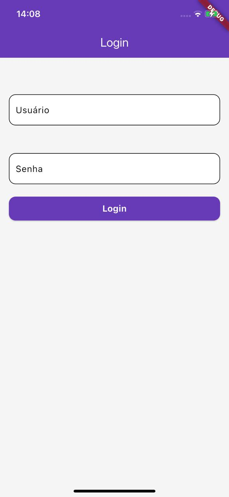
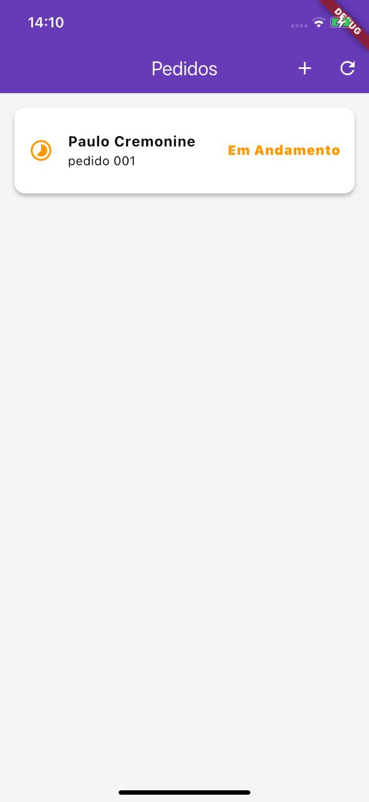
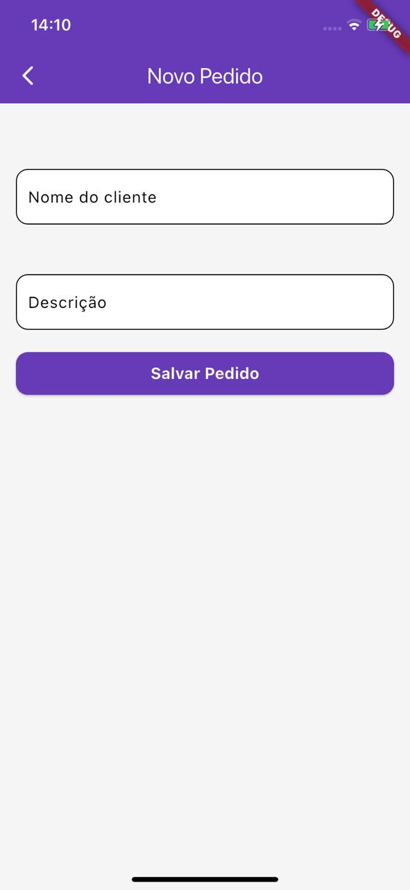
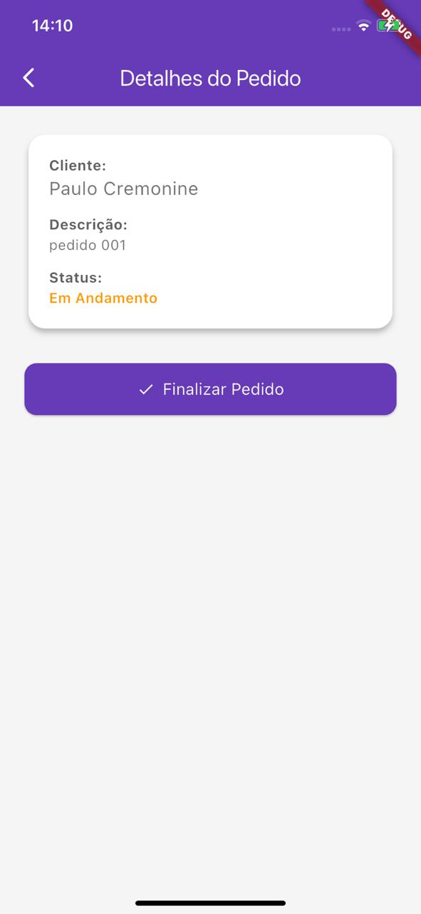
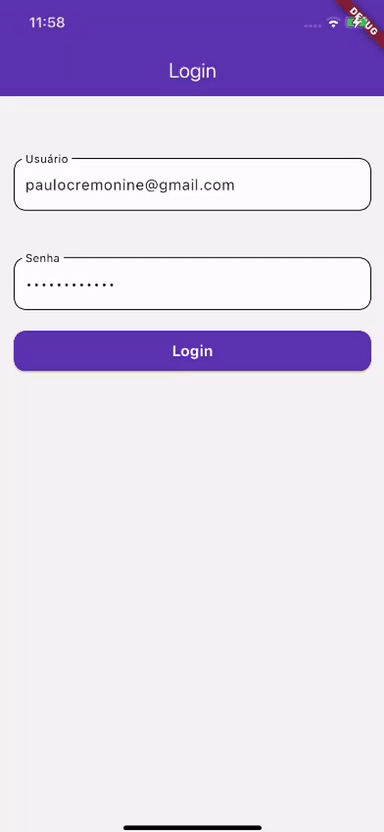

# 📦 Pedidos SW

Aplicativo Flutter para gerenciamento de pedidos, utilizando arquitetura **MVVM**, autenticação via **OAuth 2.0**, e consumo seguro de API com **refresh automático de token**.

## 📚 Tecnologias Utilizadas

* [Flutter](https://flutter.dev)
* [Provider](https://pub.dev/packages/provider)
* [GetIt](https://pub.dev/packages/get_it)
* [SharedPreferences](https://pub.dev/packages/shared_preferences)
* [http](https://pub.dev/packages/http)
* OAuth 2.0 (Password Grant)

---

## 🏧 Arquitetura MVVM

O projeto segue o padrão **MVVM (Model-View-ViewModel)**:

```
lib/
├── core/
│   ├── auth_http_client.dart   # HTTP Client com autenticação e refresh automático
│   └── di/
│       └── injector.dart       # Injeção de dependência com GetIt
│
├── data/
│   └── repositories/           # Repositórios para acesso aos dados (ex: AuthRepository, PedidoRepository)
│
├── models/                     # Modelos da aplicação (ex: Pedido, Token)
│
├── view/                       # Interface do usuário (UI)
│   └── pedidos/                # Telas específicas, como PedidosScreen
│
├── viewmodel/                  # Lógica de apresentação
│   ├── auth_viewmodel.dart
│   └── pedido_viewmodel.dart
│
└── main.dart                   # Entry point
```

### ✅ Responsabilidades

| Camada         | Função principal                                              |
| -------------- | ------------------------------------------------------------- |
| **Model**      | Representa os dados do domínio (ex: `Pedido`)                 |
| **View**       | Interface do usuário, escuta e reage ao estado dos ViewModels |
| **ViewModel**  | Contém a lógica de negócio e expõe estado para a View         |
| **Repository** | Faz requisições HTTP e acessa local storage (ex: tokens)      |
| **Client**     | `AuthHttpClient` injeta tokens nas requisições HTTP           |

---

## 🔐 Autenticação OAuth2

* Login com `grant_type=password`
* Tokens são persistidos localmente com `SharedPreferences`
* Refresh automático via `AuthHttpClient` quando o token expira
* Redirecionamento automático para tela de login caso o refresh falhe

---

## 🚀 Funcionalidades

* Autenticação de usuário (login/logout)
* Listagem de pedidos
* Criação de novo pedido
* Finalização de pedido
* Atualização automática do token
* Navegação segura com controle de sessão

---

## 📂 Injeção de Dependência

Utiliza o **GetIt** para registrar e injetar instâncias:

```dart
final getIt = GetIt.instance;

void setupDependencies() {
  getIt.registerLazySingleton<AuthViewModel>(() => AuthViewModel(getIt()));
  getIt.registerLazySingleton<AuthRepository>(() => AuthRepository());
  getIt.registerLazySingleton<AuthHttpClient>(() => AuthHttpClient(authViewModel: getIt()));
  getIt.registerLazySingleton<PedidoRepository>(() => PedidoRepository(client: getIt()));
  getIt.registerFactory<PedidoViewModel>(() => PedidoViewModel(getIt()));
}
```

---

## 🔮 Prints das Telas


## Login


## Pedidos 


## Cadastro de Pedidos


## Detalhes do Pedido (Finalização do Pedido)


---

## 🎥 Vídeo de Demonstração

Você pode visualizar uma demo funcional do app neste vídeo:
[]

---

## 📦 Artefato Android (.APK)

Para instalar o app em dispositivos Android:

* Acesse a pasta `artefato_android/`
* Instale o arquivo `app-debug.apk`

```bash
adb install artefato_android/app-debug.apk
```

---

## Como Rodar o Projeto

1. Clone o repositório:

```bash
git clone https://github.com/PauloCremonine/pedidos_sw.git
cd pedidos_sw
```

2. Instale as dependências:

```bash
flutter pub get
```

3. Execute o app:

```bash
flutter run
```
